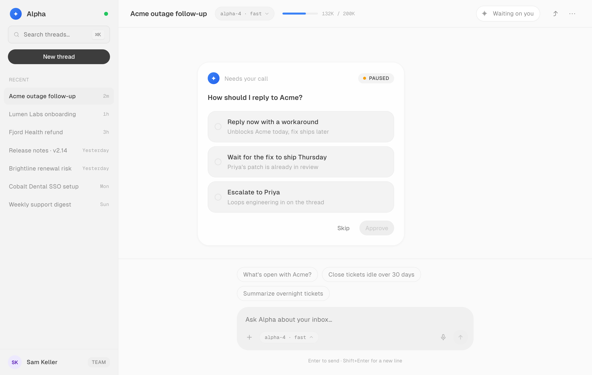
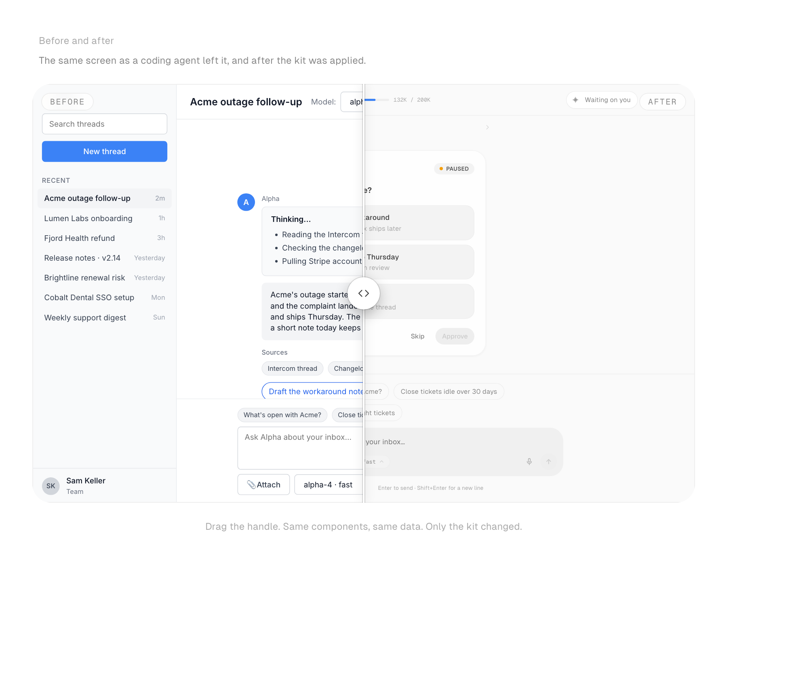

# UI by Halaska



A single-file React UI kit for AI products, built on shadcn/ui foundations. Made for founders building with coding agents. It gets a prototype most of the way to looking designed without a designer in the loop. 38 UX patterns for the moments every AI product has to get right (thinking, streaming, plans, approvals, tool activity, receipts, recovery) and around 100 styled components underneath them.

Live: **https://ui.halaska.com**



## Use it

You don't install anything by hand.

1. Open https://ui.halaska.com and press **Copy prompt**.
2. Paste the prompt into Claude Code, Cursor, Codex, Windsurf, or any agent that can fetch a file, as the first message in the project you want to improve.
3. The agent downloads the kit, wires it in, and applies it to what you've already built, screen by screen.

Prefer to do it yourself:

```bash
curl -o src/halaska-kit.jsx https://ui.halaska.com/halaska-kit.jsx
```

```jsx
import { Button, Card, Orb, PlanPreviewPattern, usePal, tokens } from "./halaska-kit";
```

Dependencies: `react` and `react-dom`. No Tailwind, no CSS setup, no chart library. The file starts with `"use client"` and self-injects its fonts and keyframes.

API reference for agents and humans: https://ui.halaska.com/llms.txt (TypeScript shim at `/halaska-kit.d.ts`).

## What's inside

- **Two UX paradigms**: a Chat screen and a Canvas (workflow builder) screen, each built only from the kit.
- **38 UX patterns** in five lifecycle groups: Conversation core, Trust & transparency, Agentic control, Output & generative UI, Ambient & beyond chat. Eight of them are prop-driven (`ThinkingTracePattern`, `StreamingAnswerPattern`, `PlanPreviewPattern`, `ApprovalCardPattern`, `AgentStatusPattern`, `HandoffPattern`, `ActionReceiptPattern`, `ErrorRepairPattern`); the rest are reference implementations to copy and adapt.
- **Components**: buttons, inputs, selectors, navigation, overlays, feedback, data display, AI elements (orbs, streaming text, confidence), and dev surfaces (snippet, file tree, browser and phone frames).
- **Foundations**: Geist type, 1px icons, an 8px spacing scale, iOS-style radii, light and dark themes, a swappable accent, and runtime switches for typeface (`setKitFont`) and motion (`setKitMotion`).

## Repository layout

```
halaska-kit/
  halaska-kit-v1.0.jsx   the kit: tokens, components, patterns, showcase page
  src/main.jsx           Vite entry for the showcase site
  scripts/               generates llms.txt, the .d.ts shim, and the source map on build
  CLAUDE.md              project notes for coding agents
```

## Run the showcase locally

```bash
cd halaska-kit
npm install
npm run dev
```

## Feedback

- Bugs, broken components, and missing patterns: [open a GitHub issue](https://github.com/Halaska-Studio/ui/issues/new).
- Design questions about your own prototype: book a short call with the studio from the "Need a hand with yours?" card on https://ui.halaska.com (it links to https://halaska.com/book).

## Licence

MIT. Use it in anything. Built by [Halaska Studio](https://halaska.com).
